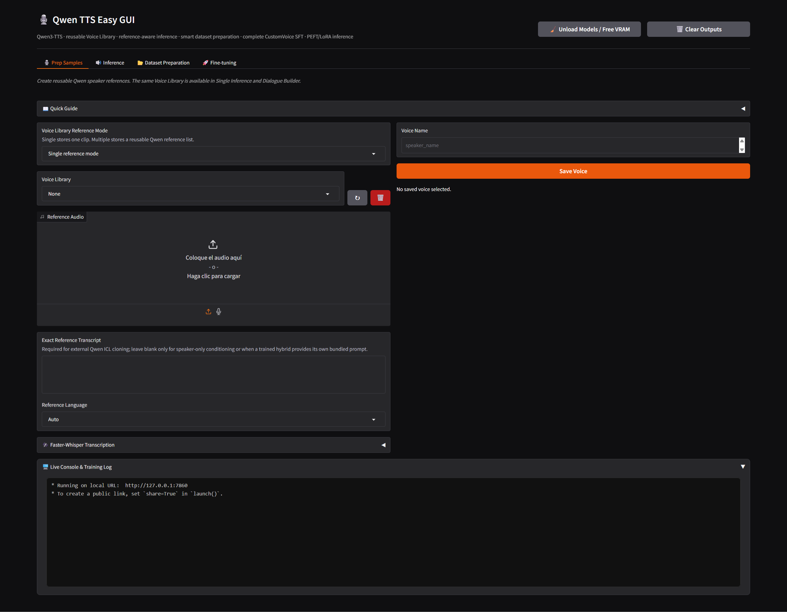
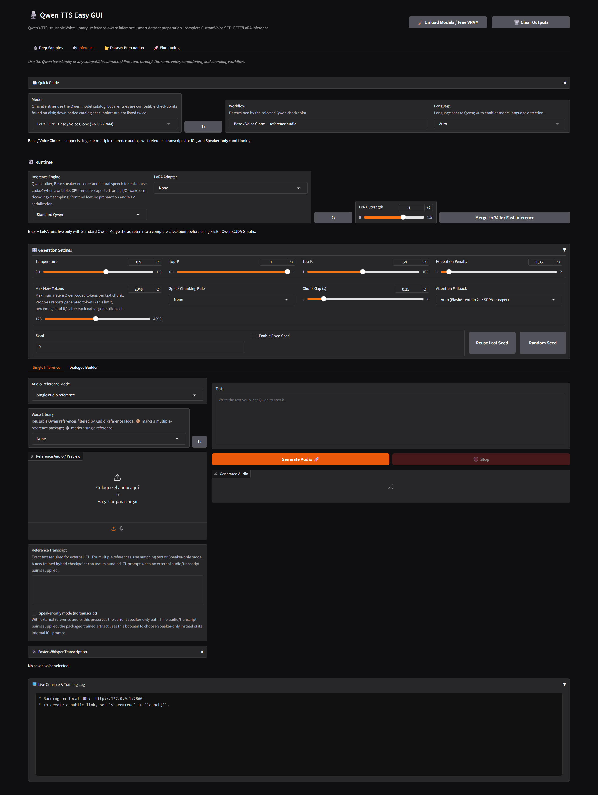
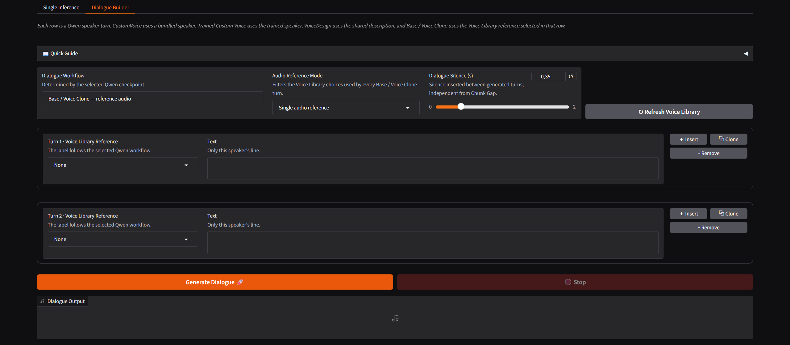
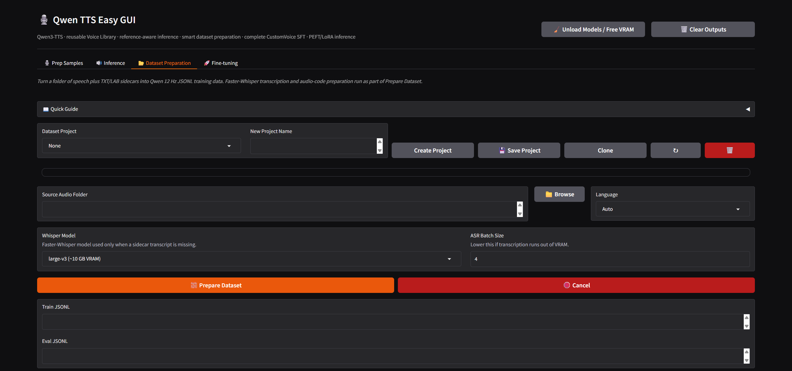
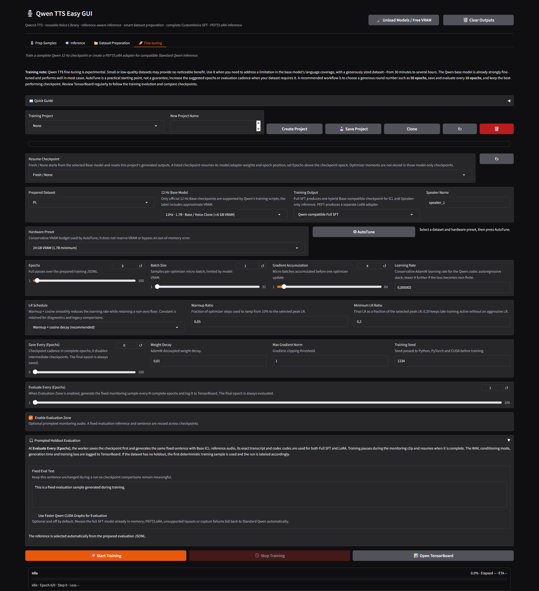

# 🎙️ Qwen TTS Easy GUI

A Windows-first application for **Qwen3-TTS**. It combines CustomVoice, VoiceDesign, zero-shot voice cloning, reusable Voice Library entries, single and multiple-reference conditioning, Dialogue Builder, Faster-Whisper transcription, project-based dataset preparation, Qwen-compatible Full SFT, PEFT/LoRA inference and CUDA-graph acceleration in one Gradio application.

---

## 🪟 Windows installation

Clone the repo or download as a .zip file:

```cmd
git clone 
```

Run the installer from the project directory:

```cmd
install.bat
```

The installer is idempotent and keeps the Python runtime, uv, Hugging Face files, temporary files and virtual environment inside the project. Existing models, samples, datasets, projects and training runs are preserved when the installer is run again.

The managed stack includes:

- project-local `uv` and Python `3.11`;
- PyTorch `2.8.0` with CUDA `12.8` wheels;
- `torchvision`, `torchaudio`, `qwen-tts` and `faster-qwen3-tts`;
- Gradio, Accelerate, PEFT, Safetensors and Hugging Face Hub;
- Faster-Whisper and CTranslate2;
- SoundFile, librosa, NumPy, SciPy and the local audio utilities;
- TensorBoard and the Qwen dataset/training dependencies.

The environment is frozen by `uv.lock`. The installer uses `uv` without a package cache and installs a pinned Windows `cp311` FlashAttention 2.8.3 wheel for Torch 2.8.0/cu128 when the platform matches. The wheel is verified before installation. If it is unavailable or cannot execute on the current system, Standard Qwen falls back to SDPA and then eager attention.

The installer runs structural checks for Python, PyTorch, CUDA visibility, Gradio, Qwen, Faster-Whisper and the optional attention backend. These checks confirm that the environment is available; they do not replace a real GPU generation or training run.

Qwen model weights and Faster-Whisper models are downloaded on demand into project-local runtime locations. Review the terms of Qwen3-TTS, the selected Hugging Face model and every dependency before redistribution or commercial use.

---

## ▶️ Launch

After installation:

```cmd
start.bat
```

The launcher uses the project-local Python environment and starts Gradio at:

```text
http://127.0.0.1:7860
```

The browser opens automatically. The environment is not reinstalled on every launch.

---

## 🧠 Qwen3-TTS architecture and training scope

Qwen3-TTS provides several conditioning workflows over the same text-to-speech family:

- **CustomVoice** uses the bundled Qwen speaker set. The 1.7B workflow accepts optional style instructions; the 0.6B workflow follows the speaker defaults and does not use that control.
- **VoiceDesign** creates a voice from a natural-language description.
- **Base / Voice Clone** performs zero-shot cloning from reference audio. External ICL uses the reference transcript; speaker-only conditioning uses the speaker embedding without a transcript and gives less content control. A trained hybrid artifact may additionally provide both modes without an external pair through its packaged prompts.
- **Unofficial Hybrid Trained** loads the hybrid Base-compatible checkpoint produced by Full SFT. It accepts external reference-audio ICL and speaker-only conditioning from the same trained model. New trained artifacts can also bundle one prepared ICL prompt, so the same boolean can choose internal ICL or speaker-only conditioning when no external audio/transcript pair is supplied.
- **PEFT/LoRA** loads an adapter trained for a compatible base checkpoint through Standard Qwen inference.

The model catalog contains the Qwen3-TTS 12 Hz 0.6B and 1.7B CustomVoice and Base models, plus the 1.7B VoiceDesign model. Approximate BF16 loading budgets are displayed beside the model names. Actual peak VRAM depends on text length, attention backend, reference processing and generation settings.

The selected checkpoint determines the available workflow and its conditioning fields. Compatible local checkpoints are discovered from `models/`, `base_models/`, `training/*/ready/` and `training/*/ready_icl/`.

The Qwen-compatible full-SFT path currently uses the Qwen 12 Hz Base family, one stable speaker name and a compatible 12 Hz tokenizer. Complete SFT checkpoints can be selected directly for inference, but their behavior is not guaranteed to match the selected Base checkpoint. PEFT/LoRA remains an adapter-based Standard Qwen path; a compatible adapter can be merged into a standalone checkpoint before using the CUDA-graph engine.

---

## 🖥️ Interface

The application has four workflow tabs and one shared live console.

## 1. 🎙️ Prep Samples



Prep Samples creates reusable Voice Library entries for inference and Dialogue Builder.

### Single reference mode

Stores one reference audio file under a stable Voice Library name. The reference can be uploaded or recorded from the microphone.

### Multiple reference mode

Uses Gradio's native multi-file selector to create a reusable package containing several reference clips. Single references and multiple-reference packages are kept as separate Voice Library entries, and the corresponding selectors show compatible entries.

### Reference transcript

For external ICL cloning, enter the exact words spoken in each reference. When several files contain different speech, keep a matching transcript for each file. Speaker-only mode can be used when no transcript is available, with less content control. A trained hybrid checkpoint with packaged prompts can use internal ICL or Speaker-only mode without asking for this external pair.

### Faster-Whisper transcription

Faster-Whisper can draft a transcript for an uploaded reference. Review and correct the result before saving the Voice Library entry. The complete Faster-Whisper family is available with approximate VRAM labels, from `tiny` through `large-v3` and `large-v3-turbo`.

Audio saved to the Voice Library is normalized to 24 kHz mono WAV and keeps its transcript, language and reference-file list.

The library also discovers an existing flat layout: `name.wav` with a same-stem `.json`, `.txt`, `.lab` or `.transcript` file. Existing `name_1.7B.prompt`, `name_1.7B.pt` and corresponding `0.6B` prompt caches are reused for compatible single-reference conditioning after their audio/transcript hash is checked. These prompt files are cached Qwen conditioning tensors, not model checkpoints or LoRA adapters.

Clean speech with limited noise, reverb, music and overlapping speakers provides more stable conditioning.

---

## 2. 🔊 Inference



Inference loads a published Qwen checkpoint, a compatible local checkpoint or a completed training result. The selected model determines the available workflow and approximate VRAM budget.

### Model workflows

**CustomVoice** exposes the bundled Qwen speakers. The 1.7B workflow also exposes an optional style instruction; the 0.6B workflow does not use that field.

**VoiceDesign** uses a natural-language voice description. The description can include age, timbre, accent, emotion, speaking style and pacing.

**Base / Voice Clone** uses a Voice Library entry, an uploaded reference or a microphone recording. It supports single and multiple-reference conditioning through Standard Qwen. External ICL requires the exact transcript; speaker-only mode does not. A trained artifact with a packaged prompt may use internal ICL or speaker-only conditioning without an external reference pair.

**Unofficial Hybrid Trained** is presented through **Base / Voice Clone** because it preserves the Base speaker encoder. With external audio and transcript, the existing ICL/Speaker-only boolean remains unchanged. When no external pair is supplied, a new export can use its bundled ICL prompt or its bundled speaker-only prompt. This complete trained artifact is an experimental project output and may fail or behave differently from the selected Base checkpoint.

### Inference engines

#### Standard Qwen

Uses the standard Qwen runtime integrated in this application. Attention selection follows:

```text
FlashAttention 2 → SDPA → eager
```

The engine supports the complete Qwen workflow family, multiple references, compatible PEFT/LoRA adapters and complete local SFT checkpoints.

#### Faster Qwen CUDA Graphs

Uses the validated CUDA-graph path for compatible Qwen 12 Hz complete checkpoints. It uses native SDPA, static generation state and explicit ICL/speaker-only selection. Multiple references, unsupported model layouts, separate PEFT/LoRA adapters and systems without CUDA use Standard Qwen automatically.

### Runtime and memory

When CUDA is available, the Qwen neural model is loaded on `cuda:0` in BF16 when supported. CPU activity remains expected for audio decoding and encoding, resampling, reference feature extraction, tokenizer-side preprocessing and copying generated audio back for WAV serialization.

Use **Unload Models / Free VRAM** when changing model families, switching inference engines or preparing to train. This releases loaded model state, Faster-Whisper state, CUDA allocator memory and Python references.

### Voice conditioning

The Base workflow accepts one reference audio item or a list of reference audios. A Voice Library entry can be selected directly, or the reference can be supplied from the conditioning area.

External ICL conditioning uses the reference audio together with its exact transcript. Speaker-only conditioning uses speaker information without transcript text. A hybrid trained artifact may additionally contain a canonical `trained_icl_prompt.safetensors` plus its transcript metadata; this internal prompt is used only when no external audio/transcript pair is supplied. The two external modes remain explicit and are not inferred from missing text.

### Instruction Library

The Instruction Library stores reusable style and delivery prompts. Select a saved entry to load it into the active instruction or voice-description field, then edit it if necessary. The same library is available from Single Inference and Dialogue Builder.

### Generation settings

Temperature, Top-P, Top-K and Repetition Penalty control sampling. Max New Tokens limits the generated speech token count. The inference progress and console report the native codec tokens generated against that per-chunk limit, the percentage and codec `it/s` after each native generation call. Qwen's public API does not expose a per-token callback, so the exact token counter is updated when each call or text chunk returns. Split / Chunking Rule can keep the text intact (`None`) or split it by sentence-ending periods (`Periods`), lines or paragraphs. Chunk Gap adds silence only between generated chunks.

### Enable Fixed Seed

With fixed seed disabled, each generation receives a fresh seed and writes it back to the Seed field. With it enabled, the visible seed is reused; if it is `0`, the first generation creates one. **Random Seed** creates a new value and **Reuse Last Seed** restores the previous value. The behavior is shared by Single Inference and Dialogue Builder.

### Long-form synthesis

`Periods` splits at sentence-ending punctuation, `Lines` splits at line breaks, `Paragraphs` splits at blank-line boundaries, and `None` keeps the complete text in one generation. Chunk Gap affects joins inside one long generation; Dialogue Silence affects the gap between Dialogue Builder turns.

### Dialogue Builder



Dialogue Builder supports multiple turns with independent text and workflow-compatible voice conditioning. Insert, Clone and Remove operations manage turns without rebuilding the dialogue. Global model, language, generation and runtime settings apply to every turn.

Base turns use the Voice Library entry selected in each row. Choose Single or Multiple audio reference mode to filter the available saved entries. The selected entry can contain one reference clip or a saved multiple-reference package. CustomVoice turns select a published speaker. Unofficial Hybrid Trained turns use the hybrid checkpoint's reference-conditioning controls. VoiceDesign turns use the shared voice description.

### LoRA and fast inference

The CUDA-graph engine captures the final model parameters and does not attach a separate PEFT adapter at generation time. Bundled CustomVoice and complete compatible hybrid trained checkpoints can be loaded directly when their 12 Hz/runtime constraints are met. A Base + LoRA adapter can run live through Standard Qwen; for Faster Qwen, select the Base model and adapter, then use **Merge LoRA for Fast Inference** to create a standalone checkpoint under `models/fast_merged/`. The original model and adapter remain unchanged, including any packaged speaker-only or internal ICL prompts. There is no validated hot-LoRA path for Faster Qwen CUDA Graphs.

---

## 3. 📂 Dataset Preparation



Dataset Preparation is project-aware. It accepts WAV, FLAC, MP3, M4A and OGG files together with `.txt`, `.lab` or `.transcript` sidecars.

The preparation pipeline:

- normalizes audio to the Qwen training format;
- reuses a valid same-stem sidecar transcript when available;
- uses Faster-Whisper for files without a usable transcript;
- creates training and evaluation JSONL files;
- runs the Qwen 12 Hz audio-code preparation step with `Qwen3-TTS-Tokenizer-12Hz`;
- records source files, transcripts, language, duration and processing metadata in a manifest.

### Dataset output

```text
datasets/<project>/
├─ wavs/
├─ train_raw.jsonl
├─ eval_raw.jsonl
├─ train_with_codes.jsonl
├─ eval_with_codes.jsonl
└─ dataset_manifest.json
```

Existing audio/transcript pairs are reused whenever possible. Dataset preparation does not replace a valid sidecar transcript with automatic transcription.

When preparation completes successfully, the project name is retained, the prepared dataset is refreshed and selected in Fine-tuning, and the matching Training Project is selected when it exists.

---

## 4. 🚀 Fine-tuning

> [!WARNING]
> Qwen TTS fine-tuning is experimental. Small or low-quality datasets may provide no noticeable benefit. Use it when you need to address a limitation in the base model's language coverage, with a generously sized dataset—from 30 minutes to several hours. The base model is already strongly fine-tuned and performs well in most cases. AutoTune is a practical starting point, not a guarantee; increase the suggested epochs or evaluation cadence when your dataset requires it. A recommended workflow is to choose a generous round number such as **50 epochs**, save and evaluate every **10 epochs**, keep the best-performing checkpoint and review TensorBoard regularly to follow the training evolution.



### Training outputs

**Qwen-compatible Full SFT** publishes one `training/<project>/ready_icl/` hybrid Base-compatible checkpoint. ICL means *in-context learning*: generation receives reference codec codes, the exact reference transcript and the learned speaker representation, allowing the trained voice to follow reference tone/prosody. New exports also package one canonical ICL prompt from the prepared dataset, so the model can use ICL without external audio or transcription when no external pair is supplied. Inference can disable ICL with **Speaker-only mode**, which keeps the reference speaker representation but does not require a reference transcript. The current Qwen training route is single-speaker and uses the prepared 12 Hz Base dataset format.

**PEFT LoRA adapter (Base ICL compatible)** produces a smaller adapter under `training/<project>/adapter/` for compatible Standard Qwen inference. It retains the selected Base model's external ICL capability and, for new exports, packages one canonical internal ICL prompt as well; the Evaluation Zone still uses reference audio plus its exact transcript without merging a checkpoint. The adapter can be selected directly in Standard Qwen or merged once into a standalone checkpoint for the CUDA-graph engine.

### Hardware Preset → AutoTune

Select a prepared dataset, choose a 0.6B or 1.7B Base model, select a hardware profile and press **AutoTune**. AutoTune reads train/eval counts, audio duration distribution, Qwen audio-code frame lengths and transcript lengths together with model size, output mode and VRAM profile. It proposes a complete conservative profile for:

- epochs and batch size;
- gradient accumulation;
- learning rate;
- learning-rate schedule, warmup ratio and minimum-LR ratio;
- checkpoint and prompted-evaluation cadence;
- weight decay and gradient clipping;
- training seed and attention backend;
- LoRA rank, alpha and dropout when PEFT output is selected.

Checkpoint and prompted-evaluation cadence are expressed in complete epochs.
The worker still reports optimizer updates for loss and progress, but batch
size and gradient accumulation do not change the selected epoch cadence. All
values remain editable and are saved with the Training Project.

### Training controls

Training exposes epochs, batch size, gradient accumulation, learning rate, warmup-plus-cosine or constant schedule, warmup/floor ratios, save/evaluation cadence in epochs, weight decay, maximum gradient norm, seed, attention fallback and optional LoRA parameters. Training **Auto** uses `SDPA → eager` for numerical stability; FlashAttention 2 remains available as an explicit opt-in. The recommended learning-rate profile is conservative for Qwen's autoregressive codec stack, and a non-finite loss/gradient stops the worker before a corrupted checkpoint is written.

### Resume Checkpoint

**Fresh / None** starts from the selected local Base model and resets the selected Training Project's generated artifacts (`ready/`, `adapter/`, `runs/` and TensorBoard logs) before launching the new run. Prepared dataset files and project metadata are preserved. After a valid full-SFT or LoRA checkpoint exists, it appears in **Resume Checkpoint** and can warm-start a new run of the matching training mode. Saved worker checkpoints contain model/adapter weights; optimizer history is not reconstructed for older checkpoints.

### Evaluation Zone

The optional Evaluation Zone is an experimental monitoring path. It generates a fixed monitoring sentence every **Evaluate Every (Epochs)** interval and always evaluates the final epoch. It selects one deterministic record from `eval_with_codes.jsonl` (or `eval_raw.jsonl`; tiny datasets without a holdout fall back to the first training record) and evaluates both Full SFT and PEFT/LoRA through Base voice-clone **ICL** with that record's reference audio, transcript and codec codes. The selected record and conditioning mode are recorded in `evaluation.json`, and the generated audio, duration, inference time and training loss are written to the local TensorBoard log. Evaluation may fail or differ from final standalone inference; it is not a replacement for a separate quantitative validation loss.

The Evaluation Zone also exposes **Use Faster Qwen CUDA Graphs for Evaluation**, disabled by default. When enabled, the worker reuses the already loaded full SFT model and attempts the CUDA-graph path for that monitoring sample. PEFT/LoRA adapters, unsupported layouts and graph-capture or generation failures automatically use Standard Qwen instead; the selected engine is written to the training log and TensorBoard metadata. This option does not start a parallel evaluator or load a second complete model.

### Checkpoints and output

The training path creates internal `checkpoint-epoch-*` files and publishes the final hybrid Base-compatible checkpoint under `ready_icl/`. New checkpoints include `trained_speaker_embedding.safetensors` for speaker-only mode and `trained_icl_prompt.safetensors` plus `trained_icl_prompt.json` for internal ICL without external audio/transcription. External reference behavior remains unchanged. PEFT training publishes the same prompt files beside its adapter. Training logs, project state, checkpoints and TensorBoard data remain under `training/<project>/`.

### Progress, logging and TensorBoard

The interface provides an HTML progress display, worker status, loss, epoch, optimizer step, evaluation epoch/step, elapsed time and ETA. Each project keeps a training log and can open its TensorBoard directory. **Stop Training** requests a graceful interruption so already-written outputs remain usable.

Successful inference, dialogue, transcription, dataset preparation, audio-code preparation, LoRA merge, model download and training completion play the project completion chime asynchronously through Windows `winsound`. Stops and failures remain silent.

---

## 🧩 Finished-model inference

A complete hybrid trained checkpoint is published under:

```text
training/<project>/ready_icl/
├─ config.json
├─ generation_config.json
├─ model.safetensors or model files
├─ speech_tokenizer/
├─ qwen_easy_training.json
├─ trained_speaker_embedding.safetensors      # speaker-only, no external reference
├─ trained_speaker_prompt.json
├─ trained_icl_prompt.safetensors             # ICL, no external reference pair
├─ trained_icl_prompt.json                    # bundled exact reference text
└─ ...
```

The model selector discovers valid local checkpoints and shows their approximate VRAM budget. `ready_icl/` appears as **Unofficial Hybrid Trained** and uses the normal **Base / Voice Clone** workflow. It accepts single or multiple external references, exact reference text and speaker-only conditioning; new exports can also use the bundled ICL or speaker-only prompt without an external reference pair.

---

## 🎛️ Memory lifecycle

**Unload Models / Free VRAM** releases Qwen model state, Faster-Whisper state, CUDA allocator memory, cached voice prompts and Python references. Switching from Standard Qwen to Faster Qwen, changing model checkpoints or beginning training establishes a fresh model boundary.

The normal WAV path uses SoundFile and the local resampling utilities. Generated audio is copied back to CPU before it is written under `outputs/`.

---

## 📊 Shared console and status

The shared **Live Console** mirrors model loading, attention fallback, inference phases, transcription, dataset preparation, training progress and output paths. Training status includes project, phase, worker state, step, loss, progress file and log path.

---

## 📦 Models and downloads

Qwen checkpoints are downloaded on demand into project-local model directories. Faster-Whisper models are downloaded when transcription is requested. The model refresh control rescans local assets and does not delete or replace existing files.

The approximate model budgets shown by the interface are loading estimates, not hard VRAM guarantees. Peak allocation varies with the selected checkpoint, text length, attention implementation, reference count and generation settings.

---

## 📂 Important directories

```text
Qwen TTS Easy GUI/
├─ app.py
├─ qwen_backend.py
├─ qwen_easy/
│  ├─ projects.py
│  └─ console.py
├─ modules/qwen3_tts/finetuning/
├─ install.bat
├─ install.ps1
├─ start.bat
├─ README.md
├─ LICENSE
├─ .venv/                  # project-local Python environment
├─ .runtime/               # uv, downloads, temporary files and HF cache
├─ base_models/            # downloaded base model assets
├─ models/                 # local and merged model assets
├─ samples/                # reusable Voice Library entries
├─ outputs/                # generated audio
├─ datasets/               # prepared JSONL data and manifests
├─ projects/               # Dataset and Training project state
├─ training/               # runs, checkpoints, logs and ready models
├─ loras/                  # compatible local LoRA adapters
├─ instructions/           # saved instruction library
└─ assets/                 # small application assets
```

Generated environments, model files, user audio and training outputs are excluded from publication by `.gitignore`.

---

## 🧪 Recommended workflow

1. Run `install.bat` and launch with `start.bat`.
2. Load a published model and test CustomVoice, VoiceDesign or Base / Voice Clone with a short clean sample.
3. Save a Voice Library entry with its exact transcript when ICL cloning is needed.
4. Compare Single Inference and Dialogue Builder using the same language, reference and generation settings.
5. Prepare a consistent single-speaker dataset with paired transcripts whenever possible.
6. Select the dataset in Fine-tuning and run AutoTune for the available model and VRAM profile.
7. Start with **Qwen-compatible Full SFT** for one hybrid trained checkpoint; use PEFT LoRA when an adapter-based experiment is preferred. With external reference audio, enable or disable ICL according to whether its transcript should condition generation. With a packaged trained prompt and no external pair, the same control selects internal ICL or Speaker-only conditioning.
8. Compare intermediate and final results with the untouched Base model using fixed reference audio, transcript and evaluation text. The Evaluation Zone intentionally uses this external reference even when the checkpoint also contains a no-reference prompt.
9. Merge a compatible LoRA only after confirming the adapter quality and checkpoint compatibility.
10. Keep the earliest checkpoint that improves the target voice without introducing pronunciation, stability or generalization regressions.

---

## ⚠️ Practical limitations

- Qwen 12 Hz SFT is currently the supported training format and is intended for one speaker per training project.
- PEFT/LoRA requires a compatible architecture, base checkpoint and tokenizer.
- External ICL quality depends strongly on transcript accuracy and reference cleanliness; bundled ICL quality depends on the canonical reference selected when the artifact was exported.
- Multiple-reference conditioning uses Standard Qwen; the CUDA-graph path uses one reference.
- CUDA Graphs are limited to compatible 12 Hz PyTorch checkpoints and may fall back when the driver, GPU or model layout cannot capture successfully.
- Fixed seeds improve reproducibility but do not guarantee bit-identical output across devices, kernels or backend versions.

---

## 🔗 Credits

This project uses and integrates the following public projects and model sources:

- [Qwen3-TTS](https://github.com/QwenLM/Qwen3-TTS);
- [Faster Qwen](https://github.com/andimarafioti/faster-qwen3-tts);
- [Faster-Whisper](https://github.com/SYSTRAN/faster-whisper);
- [Hugging Face Hub](https://github.com/huggingface/huggingface_hub);
- [Gradio](https://github.com/gradio-app/gradio).

The project contains original Windows installer, GUI, project-state, dataset and training integration code. It does not relicense upstream model weights or upstream packages.

---

## License

See [LICENSE](LICENSE) and the licenses of the upstream projects, dependencies and model weights used by this application.
